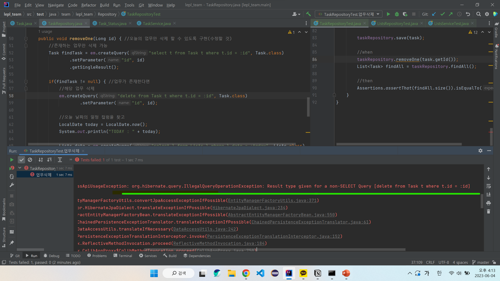

## LePl Team Project

-----------------

1. 요구사항 분석
    
2. 도메인 모델 분석
    
3. 엔티티 설계
    
4. 테이블 설계
    

     

    

------------------

### 06/01
* 연관관계 편의 메서드 추가
* MemberRepository, MemberService 개발
* Member Test 추가 

### 06/02
* ListsRepository, ListsService 개발
* Lists Test 추가 
* Task에 업무가 추가되면 Lists에 오늘의 일정이 추가되어야 함. 

Ex) Task: 공부하기 추가 --> Lists: 날짜와 해당 날짜의 업무 개수 추가! 

### 06/03
* TaskRepository 개발 
* TaskRepositoryTest 진행 
* 업무 추가시 일정의 count 개수 증가 구현

### 06/05
* 업무 삭제 기능 추가 
* 삭제시 delete query 사용 -> 오류 발생 

delete 쿼리문은 반환 값이 없음 => createQuery() 의 매개변수중에 Task.class는 반환된 결과를 해당 엔티티 클래스(Task) 형식으로 자동 매핑해주는 역할을 한다. 

하지만 반환 값이 없는 쿼리에 반환 결과 매핑 역할을 해주는 매개변수를 사용해서 오류가 발생했던 것이다. 

Task.class 를 지우고 실행 해보니 원하는 방식으로 test가 진행되었다. 

